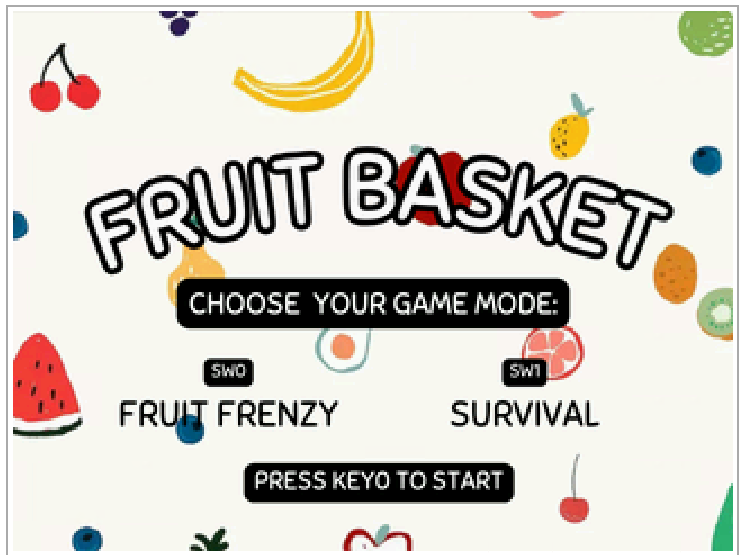
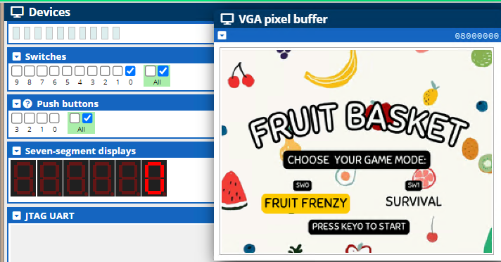
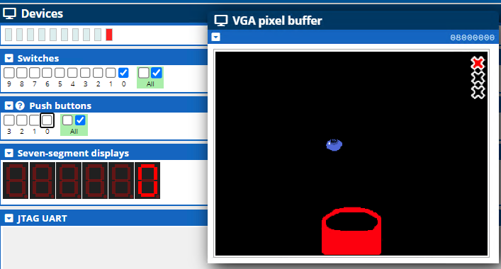
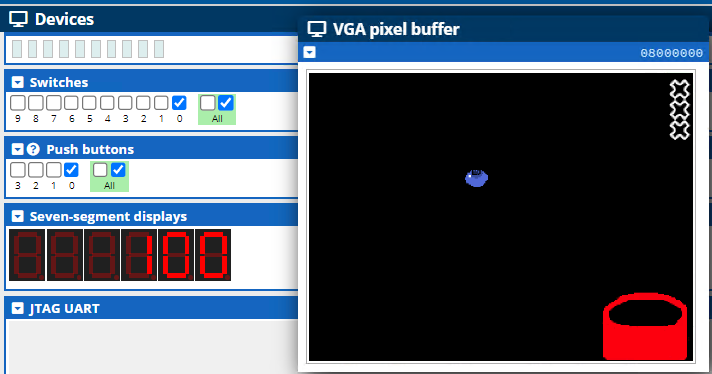
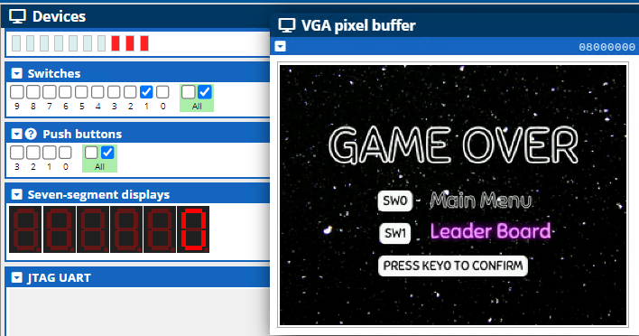
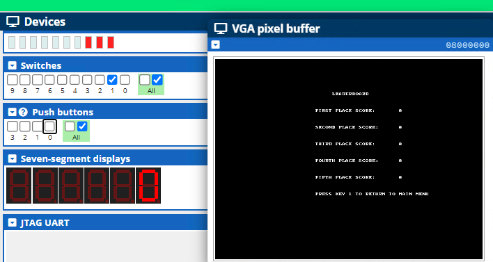
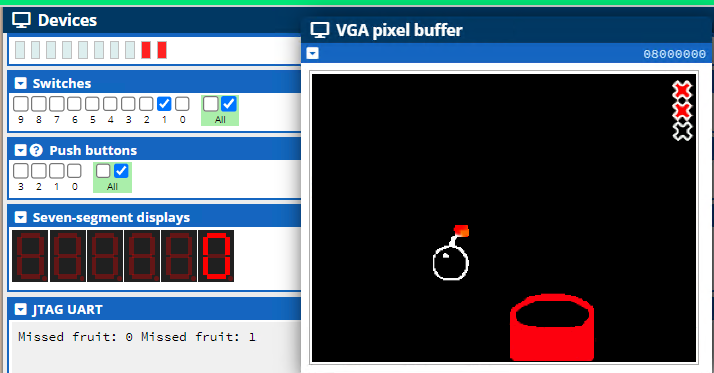

# ECE243 FINAL PROJECT SUBMISSION PDF
Shirley Li and Yaqi Zhen

#### Description:
    The fruit basket game is a game where a basket moves left and right to catch random fruit dropping down on a screen. There are two main game modes for the game, fruit frenzy and survival.

#### Main goal:
    - Fruit Frenzy: catch as many fruit as you can, every fruit caught is +100 points, miss four fruits and it's game over
    - Survival: has all the rules that fruit frenzy has, except a bomb is added to the game. If a bomb is caught it's immediately game over, the goal is to catch as many fruits as possible while avoiding the bomb. Each fruit caught will also be +100 points.

#### I/O:
    - Switches
        - Controls which game mode to play by updating the VGA in the main menu
    - KEYs (Note: the KEYs poll for the edge capture register so press it down for longer to make sure it detects the input)
        - To select which game mode
        - To return to main menu
        - To select the leaderboard
        - To control the basket in-game to move left or right

    - LEDs
        - displays the number of fruits missed. (MAX 3)
    - HEX 
        - Displays current high score. (up to maximum amount the HEX can display)
    - VGA
        - Main display of game interface, all graphics in game either free to use or drawn by hand
    - Audio i/o
        - Plays background music on the main menu and sounds effects when fruit is caught and missed.
    - Timer
        - Controls the drop speed of the fruit over time.

#### How to play:
    1. Run FINAL.c on cpulator or quartus prime, no other files are needed
    2. The starting page should look like this

    3. Use SW0 to select fruit frenzy and SW1 to select survival, the VGA should highlight the mode you selected.(give it a second if you are on CPUlator because this chunk of code is also sampling audio at the same time so it's a little slow as displaying ont the vga)

    4. Once the fruit start dropping, press the KEY0 to move the basket right, and KEY1 to move the basket left. (The image below shows that I have caught 0 fruit and missed one fruit)

    5. The HEX updates if I caught fruit, as the game goes on, the speed in which the fruit dropping will increase and make it more difficult to catch fruit

    6. Once you miss four fruit the game over screen will prompt up

    7. You can now use the switches to choose to either to go back to the main menu or to the leaderboard, press KEY0 to confirm choice
    8. Return to the main menu by pressing KEY1

    9. Now you can play another game mode or play the same one.
    10. In survival mode, these are the bombs, make sure to avoid them or else it will be game over

#### GITHUB Link to the game:
https://github.com/shirwewe/fruit-box-game

#### Attribution Table
- Shirley
    - Helped contribute to brainstorming of game ideas and general game logic
    - Designed the main menu page, gameover page and integration into the game
    - Designed game mode fruit frenzy and it's operations
    - Score display, led display, timer, switches and keys integration
    - Background music in the main menu and sound effect for game modes 
    - Leaderboard (flop), the main goal was to get the character display working I did not make a functional leaderboard updating system
- Yaqi
    - Main menu page, game over page integration
    - Design the game mode of survival, randomly dropping fruits on the screen, including the bomb.
    - Draw multiple fruits on the screen and design the logic of game over with the bomb, the mode is kind of working, but it does not operate well due to the time cycles.
